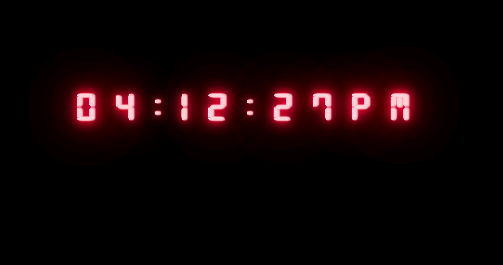

### JAVASCRIPT CLOCK

Building your own digital clock with JavaScript is a relatively easy small project to practice vanilla javascripts' variables and simple 'if' loops.

Again, you want to use some SASS to customize the design and make your JavaScript clock look fancy.

Create a nice layout with some SASS to make it look pretty.

### Install SAAS

- Project Template HTML CSS boilerplate with built-in sass support
- Installing dependencies: `npm install`
- Running for development: `npm start`
- Building for publication: `npm run build`
- Publishing online: `npm run deploy`
- Project structure: `scss` and `styles` folders

### Sass nesting

- Installing sass: `npm install -g sass`
- Creating input: `.scss` vs. `.sass`
- Sassy Magic: nesting css rules
- Comparing the output: `sass [input file] [output file]`
- Converting a folder into a folder `sass [input folder]:[output folder]`
- Watching for changes: `sass --watch [input folder]:[output folder]`
- Sass variables: Defining with `$[name]: [value]`, Using with `$[name]`
- Sass functions
- Sass maps
- Project: color guide in Sass

### Saas flex and mixins

- Review from previous days (Sass)
- Defining mixins: `@mixin [name](){ ... }`
- Using mixins: `@include [name]()`
- Parameters and arguments:
  `@mixin [name]([parameters])`, `@include [name]([arguments])`
- Main use case for mixins: Using bootstrap breakpoint mixins
- Project: continue color guide in Sass with extra points.

## About DOM

Important issues while working with DOM:

### SPA

- DOM aka Document Object Module
- DOM tree
- Javascript in the browser: XMl, JSON, jQuery, Ajax, API
- JS Engines: V8 (Chrome, Node, Edge), SpiderMonkey (Firefox), Chakra (Internet Explorer)
- Adding javascript to HTML: The `<script>` tag, External JS with `<script src="...">`
- The Window object
- Host object
- Native object: [Global-Objects](https://developer.mozilla.org/en-US/docs/Web/JavaScript/Reference/Global_Objects)
- `window.prompt()` and `window.alert()`
- Project: The Guessing Game

### Node

- window.alert === alert
- document.querySelectorAll() will return A non-live `NodeList` 🧐
- Node tree https://dom.spec.whatwg.org/#concept-node
- `document.getElementById(<id string>)`
- `HTMLElement.style` property
- `document.querySelector(<selector string>)`
- `document.querySelectorAll(<selector string>)`
- Project: Dom-querying

### New elements in DOM

- `document.write()` and script injection
- Creating Elements: `document.createElement(<tag name>)`
- Adding elements to the page: `Element.appendChild(<Element object>)`"
- ToDo app with DOM

### Slecting in DOM

- DOM Querying: Getting elements from `document`
- Selecting elements with `document.getElementById(<id string>)`
- Element objects: quick overview in the console
- Element style: Changing css styles with `HTMLElement.style` property
- Selecting by CSS query: `document.querySelector(<selector string>)`
- Getting more than one element: `document.querySelectorAll(<selector string>)`

### Traversing in DOM

- DOM Traversing: Jumping from one element to its relative
- Node vs. Element:
  Comparing `Node.previousSibling` and `Element.previousElementSibling`
- Getting an element's closest parent: `Element.closest(<selector string>)`
- Testing an element against a selector: `Element.matches(<selector string>)`
- Getting all children of an element: `ParentNode.children`
- Selecting specific children: `ParentNode.querySelector(<selector string>)`
- Finding more traversal techniques: MDN

### Event listeners

- Event listeners
- update to the generate password exercise
- simple game

### Clear in DOM

- User Events (interaction) and Browser Events (loading, etc...)
- Keyboard Events: `keydown`, `keyup`
- The event object properties: A console example
- Getting the target of the event: `Event.target`
- Form events: `submit`, `reset`, `Event.preventDefault()`
- Getting form values on submit:
  `target.elements[<id>]`, `target.elements[<name>]`, `Element.value`"
- Mouse Events: `click`, `mouseenter`, `mouseleave`
- Removing event listeners:
  `EventTarget.removeEventListener(<namespace>, <function reference>)`
- Listening to browser events: `DOMContentLoaded` event
- Finding more events on MDN"
- 4 exercises (currency converter _ weekend count-down _ numeral-system converter \* image-slider )

### JSON

- JSON
- Brief overview of IIFE and the Module pattern
- Advantages of scope isolation and encapsulation
- Using modules in the browser: `<script type=""module"" src=""..."">`
- Connecting files: The `import` and `export` keywords"
  "Imports and Exports:
- Default exports vs. named exports
- Destructuring imports

### Promise

- The request response cycle - Client perspective
- Non-Blocking Promises
- Blocking vs. Non-Blocking code: A brief example, `window.setTimeout()`
- Race conditions: Reading non blocking code
- Promises
- Promisifying: Converting `setTimeout()` to a promise
- Breaking Promises
- fetch() and fetch API

### Promise async

- promises
- async await
